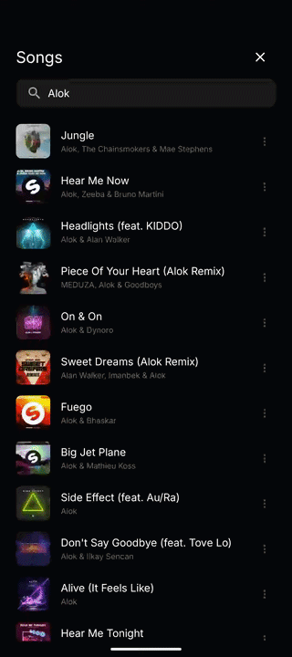
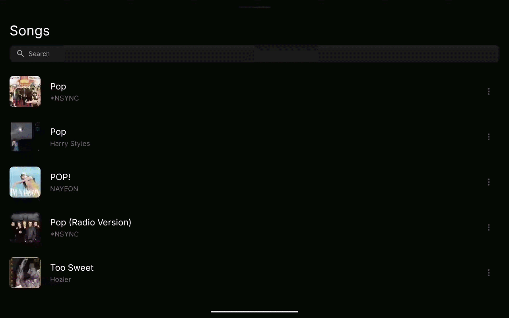
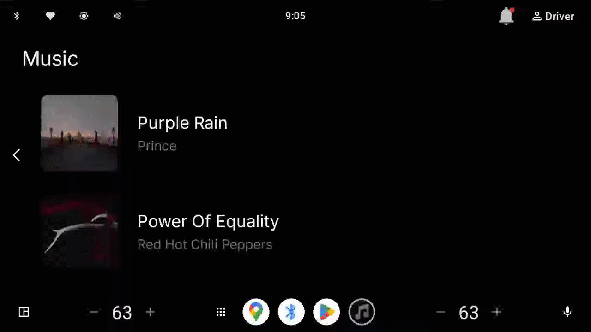
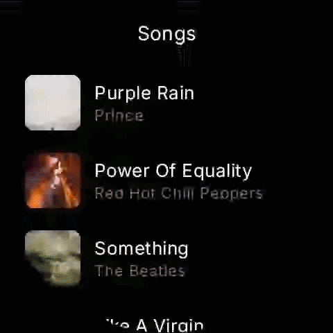

# Custom Music App

An Android music browser and player that loads catalog and search results from the **iTunes Search API**, keeps a **local library** (Room), and plays **preview streams** with **Media3 / ExoPlayer**. The UI adapts to **phone, tablet, Wear OS, and Android Auto–style** environments using a shared navigation and presentation layer.

Recording sources for the clips below live in the [`gif/`](gif/) folder at the repo root.

---

### Phone



### Tablet



### Android Auto



### Wear OS



---

## Requirements

- **Android Studio** with a recent **AGP** / **Kotlin** toolchain matching the repo (see `gradle/libs.versions.toml`).
- **JDK 11+** (project targets Java 11).
- **Android SDK**: `compileSdk` / `targetSdk` 36, `minSdk` 24.

---

## How to run

1. Open the project in Android Studio (root contains `settings.gradle.kts` and `:app`).
2. Sync Gradle.
3. Select the **`app`** run configuration and a device or emulator with network access.
4. **Run** the app. The launcher activity is `MainActivity`; a short splash is shown before the main UI.

**Network:** the app needs **internet** to fetch iTunes metadata and preview URLs. **Recently played** tracks can be read from the local DB offline, but first-time catalog/search flows expect connectivity.

---

## Architecture (high level)

The codebase follows a **layered** structure inside a single `:app` module:

| Layer | Role |
|--------|------|
| **Domain** | Models (`Music`, `MusicArtwork`, …), repository interfaces (`MusicRepository`), playback abstractions (`TrackPlaybackController`, `TrackPlaybackState`). No Android framework in pure domain types. |
| **Data** | `MusicRepositoryImpl` orchestrates **Retrofit** (iTunes), **Room** (`MusicLibraryDao`, `TrackEntity`), and **TrackMediaDownloader** (preview/audio cache). Mappers connect DTOs and entities to domain models. |
| **Presentation** | `MusicViewModel` (and related UI state) exposes `StateFlow` / `SharedFlow` to Compose; coordinates repository and playback. |
| **UI** | Jetpack **Compose** screens under `ui/smartphone`, `ui/tablet`, `ui/watch`, `ui/androidauto`, shared **components**, and **navigation** hosts. |

**Patterns in use**

- **MVVM**: ViewModels hold UI state; composables collect flows and call one-shot actions.
- **Dependency injection**: **Dagger Hilt** (`@HiltAndroidApp`, `@AndroidEntryPoint`, `@HiltViewModel`). Bindings live in `data/di` (`RepositoryModule`, `PlaybackModule`, `NetworkModule`, `DatabaseModule`).
- **Adaptive UI**: `DeviceAdaptationState` + `AppNavHost` pick **Smartphone** vs **Tablet** vs **Android Auto** vs **Smartwatch** navigation graphs based on window size, foldables, car connection, and watch feature flags.

**Playback**

- `ExoTrackPlaybackController` implements `TrackPlaybackController` using **Media3 ExoPlayer** (see `PlaybackModule`).
- Previews and saved tracks can use local files after download via `TrackMediaDownloader`.

**Remote API**

- **iTunes Search** (`https://itunes.apple.com/search`) for search and a fixed “popular” query; **lookup** for album detail (`amgAlbumId` / `collectionId`). Apple documents a **limit** of 1–200 per search; paging follows that contract in the repository.

---

## Tooling & stack

- **Build**: Gradle **Kotlin DSL**, **version catalog** (`gradle/libs.versions.toml`) for dependencies and versions.
- **Language**: **Kotlin** with **Jetpack Compose** (Compose BOM), **Material 3** (+ legacy Material for pull-to-refresh where used).
- **Async**: **Kotlin coroutines** (`Dispatchers.IO` in repository, `viewModelScope` in ViewModels).
- **Networking**: **Retrofit** + **Gson**, **OkHttp**.
- **Persistence**: **Room** (single database, destructive fallback on migration for development simplicity).
- **Images**: **Coil** for Compose.
- **Navigation**: **Navigation 3** (`navigation3-runtime`, `navigation3-ui`) for app navigation.
- **Window / foldables**: **AndroidX Window** for folding features as part of adaptation.

---

## Project layout (concise)

```
app/src/main/java/dev/luanramos/custommusicapp/
├── CustomMusicApplication.kt    # @HiltAndroidApp
├── MainActivity.kt              # Splash → AppNavHost
├── data/
│   ├── di/                      # Hilt modules
│   ├── local/db/                # Room entities, DAO, DB
│   ├── local/media/             # Preview download / cache
│   ├── remote/itunes/           # Retrofit API + DTOs
│   ├── repository/              # MusicRepositoryImpl
│   └── player/                  # ExoPlayer-backed playback
├── domain/                      # Models + repository & playback contracts
├── presentation/                # ViewModels, UI state
├── navigation/                  # AppNavHost, per–form-factor nav hosts
└── ui/                          # Compose screens, theme, utilities
```

---

## Testing

- **Unit tests** (`src/test`): **JUnit 4**, **MockK**, **kotlinx-coroutines-test** (e.g. `MusicRepositoryImplTest`, `MusicViewModelTest`).
- **Android instrumented tests** (`src/androidTest`): Hilt test runner and modules as configured in `app/build.gradle.kts`.

Run unit tests:

```bash
./gradlew :app:testDebugUnitTest
```

---

## Permissions

Declared in `AndroidManifest.xml`, including:

- `INTERNET` — iTunes and streaming previews  
- `ACCESS_NETWORK_STATE` — connectivity awareness where used  

---

## Notes

- **Android Auto / DHU / automotive**: car UIs are routed via adaptation state; some surfaces still use **mocked** catalog data where product scope is limited (see in-code TODOs where relevant).
- **Rate limits**: Apple’s public Search API is intended for light use; avoid hammering it in tight loops.

---

## License / third-party

This project integrates Apple’s **iTunes Search API** for metadata and preview URLs. Use complies with [Apple’s terms](https://www.apple.com/legal/internet-services/itunes/dev/stdeula/) and [affiliate / API usage guidelines](https://performance-partners.apple.com/) where applicable.
